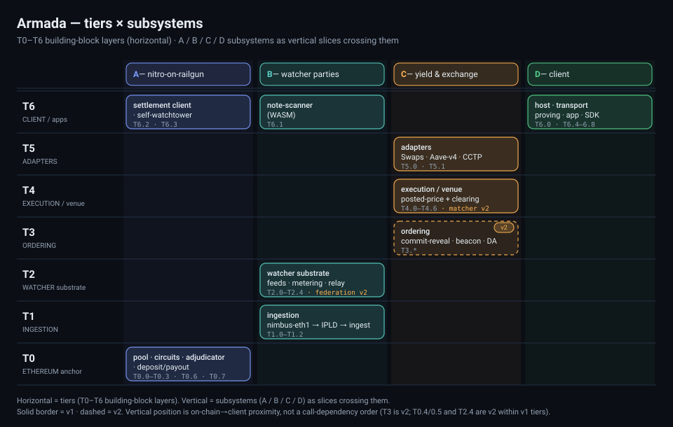

# 5. Building Block View

arc42 §5 · **2026-09-06**

This section gives the static decomposition of the system. **Level 1** is the seven **tiers** (T0–T6) — horizontal building-block layers running from the on-chain anchor up to the client — and each tier's whitebox detail lives in its own doc (`T0-ethereum-anchor.md` … `T6-client-apps.md`). The four **subsystems** — work packages A/B/C/D ([§0](./00-work-packages.md)) — are the **vertical slices**: each owns `T#.#` items across several tiers and consumes the rest across ICDs. Tiers and subsystems are two axes over one item set — the familiar layered view with feature slices crossing it — and the **item registry** below is the single model of record, every buildable item carrying one `T#.#` id with its `status` and `release` facets. (The "lines" of §4/§8 are a third grouping of those same items.)

## Level 1 — the tier stack

```
 tier                    building blocks                                    owner    release
 ------------------------------------------------------------------------------------------
 T6  CLIENT / apps       wallet · light client · self-watchtower · SDK      A·B·D    v1
 T5  ADAPTERS            Swaps · Aave-v4 yield · CCTP                        C        v1
 T4  EXECUTION / venue   posted-price venue + clearing                       C        v1  (matcher v2)
 T3  ORDERING            commit-reveal + beacon · epoch set-agreement · DA   C        v2
 T2  WATCHER substrate   proof-carrying feeds · metering · relay             B        v1  (federation v2)
 T1  INGESTION           nimbus-eth1 state-diff → IPLD → watcher ingest      B        v1
 T0  ETHEREUM anchor     pool · circuits · adjudicator · deposit/payout      A        v1  (econ-security v2)
```

Read this as a layered building-block view: the tiers are horizontal layers, and the subsystems (A/B/C/D) are vertical slices that cross them — the standard shape of a layered architecture with feature slices. The `owner` column is each tier's primary subsystem; **T6 is shared** (A owns the settlement client and watchtower, B the note-scanner, D the host, transport, proving, and app). Vertical position is on-chain-to-client proximity and `release` marks v1/v2 phasing; neither is a strict call-dependency order — for example the ordering tier (T3) is v2-only, and some v2 items (T0.4/T0.5 economic-security, T2.4 federation) light up later inside otherwise-v1 tiers.

<p></p>

| Tier | Responsibility | Owner(s) | Whitebox |
|---|---|---|---|
| **T0** Ethereum anchor | On-chain pool, adjudicator, the deposit/payout settlement boundary, trusted setup, economic-security contracts | A (T0.4/T0.5 v2) | [`T0-ethereum-anchor.md`](./T0-ethereum-anchor.md) |
| **T1** Ingestion | Proof-carrying Ethereum state feed (nimbus-eth1 → IPLD → watcher ingest) | B | [`T1-ingestion.md`](./T1-ingestion.md) |
| **T2** Watcher substrate | Private, metered, P2P proof-carrying feeds + federation | B | [`T2-watcher-substrate.md`](./T2-watcher-substrate.md) |
| **T3** Ordering (v2) | Provably-fair sequencing for the matcher | C (v2) | [`T3-ordering.md`](./T3-ordering.md) |
| **T4** Execution / venue | Posted-price RFQ clearing + yield rails; v2 matcher | C | [`T4-execution-venue.md`](./T4-execution-venue.md) |
| **T5** Adapters | Swaps, Aave-v4 yield, CCTP + the routing interface | C | [`T5-adapters.md`](./T5-adapters.md) |
| **T6** Client / apps | Wallet, mobile light client, self-watchtower, app | A · B · D | [`T6-client-apps.md`](./T6-client-apps.md) |

## Item registry (the single model)

Facets: **status** (`net-new` · `reuse` / `built/reuse` · `partial`) · **release** (`v1` ship first · `v2` later · `opt`).

### T0 · Ethereum anchor
| id | item | status | release |
|---|---|---|---|
| T0.0 | Shielded pool — our own implementation of the Railgun design (spec-compatible); POI policy; fee=0 (ADR-0014) | net-new | v1 |
| T0.1 | Circuits + trusted setup — our own JoinSplit circuits (spec-compatible); reuse Perpetual PoT Phase-1; own Phase-2 MPC (1-of-N) (ADR-0014) | net-new | v1 |
| T0.2 | Nitro adjudicator — `go-nitro` NitroAdjudicator / ForceMove / MultiAssetHolder | built/reuse | v1 |
| T0.3 | Deposit/payout contract — the Nitro↔Railgun boundary (notes in / notes out) | net-new | v1 |
| T0.4 | Registry + bond contract — venue/party bonding | net-new | v2 |
| T0.5 | Sequencing-cert + fraud-proof verifier | net-new | v2 |
| T0.6 | Native channelized commitment — amount-privacy-in-play (change to our own circuits ⇒ re-run T0.1) | net-new | opt |
| T0.7 | Anonymity-set strategy — bootstrap own crowd + Railgun import bridge | strategy | v1 |

### T1 · Ingestion
| id | item | status | release |
|---|---|---|---|
| T1.0 | State-diff source — nimbus-eth1 stateless/witness + Aristo emitter | partial | v1 |
| T1.1 | IPLD proof-carrying state diffs | partial | v1 |
| T1.2 | Watcher ingest config — index T0.0 commitments/nullifiers + T0.2/T0.3 events | net-new | v1 |

### T2 · Watcher-party substrate
| id | item | status | release |
|---|---|---|---|
| T2.0 | Proof-carrying feeds — watcher-ts `getStorageAt → {value, proof}` GraphQL | reuse+config | v1 |
| T2.1 | Nitro voucher metering — `payments.ts`; funded at note creation | reuse+config | v1 |
| T2.2 | P2P peer substrate — `ts-nitro` / `@cerc-io/peer` (browser/mobile/server) | reuse | v1 |
| T2.3 | Transport — Waku pub/sub + libp2p-noise 1:1; circuit-relay + STUN/TURN; **optional Nym IP-privacy underlay** (opt-in) | reuse | v1 |
| T2.4 | Federation + bond + threshold DKG signing — `chain-signatures` DSS (bond = T0.4) | partial | v2 |

### T3 · Ordering (v2)
| id | item | status | release |
|---|---|---|---|
| T3.0 | Commit-reveal sequencer + randomness beacon | net-new | v2 |
| T3.1 | Epoch set-agreement / DA | net-new | v2 |
| T3.2 | DSS attestation — sequencing certs / inclusion receipts (slashing via T0.4/T0.5) | net-new | v2 |

### T4 · Execution / venue
| id | item | status | release |
|---|---|---|---|
| T4.0 | Posted-price contract — `priceSetter` → governance | net-new | v1 |
| T4.1 | Quote/settle ForceMove app — registered in the T0.3 app registry | net-new | v1 |
| T4.2 | Venue solver — automated market-making (internalization, flash-loan hedge, Aave rebalance); *v1 fills from static inventory instead* | net-new | v2 |
| T4.3 | Fee-split allocation — user / protocol / integrator on channel state | net-new | v1 |
| T4.4 | ETH yield — shielded wstETH note (intrinsic, non-rebasing) | config | v1 |
| T4.5 | USDC yield — LP-buffered batched Aave rail; saturation → dribble / become-LP | net-new | v2 |
| T4.6 | ex_net matcher + LP vault (= T4 venue + T3 ordering) | net-new | v2 |

### T5 · Adapters
| id | item | status | release |
|---|---|---|---|
| T5.0 | Adapters — CCTP (built) · Aave-v4 yield · Swaps; build or reuse Railgun Cookbook recipe | reuse/net-new | v1 |
| T5.1 | Routing interface — how the T4 venue routes to/from the adapters | interface | v1 |

### T6 · Client / apps
| id | item | status | release |
|---|---|---|---|
| T6.0 | Wallet base — laconic-wallet fork; BIP-39/HD/secure-enclave custody | partial/reuse | v1 |
| T6.1 | WASM note-scanner + WebView↔RN key bridge | net-new | v1 |
| T6.2 | Settlement client — drive T0.3 deposit/payout; channel lifecycle | net-new | v1 |
| T6.3 | Self-hosted watchtower — challenge response (with T0.2); gated on T2 feed freshness | net-new | v1 |
| T6.4 | Address rotation + per-venue loyalty keys | net-new | v1 |
| T6.5 | Mobile transport — native gomobile (go-waku, go-libp2p-noise); interim WebView | net-new (crux) | v1 |
| T6.6 | Groth16 mobile proving — snarkjs-WASM / rapidsnark; artifacts from T0.0/T0.1 | reuse (constraint) | v1 |
| T6.7 | Armada-branded app + SDK wiring | product | v1 |
| T6.8 | Identity — optional Self zk-passport attestation | opt | opt |

*Decisions that shaped these items: [§9 ADRs](./09-architecture-decisions.md). Recurring concerns spanning tiers: [§8 cross-cutting concepts](./08-crosscutting-concepts.md).*
