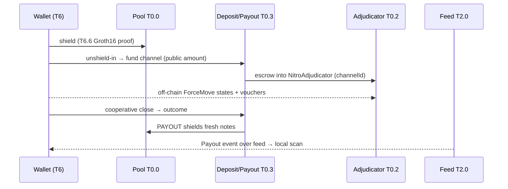
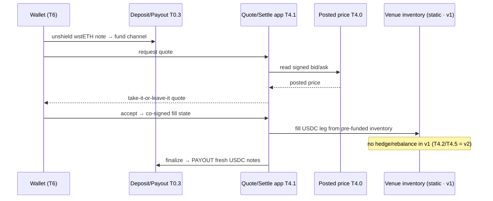
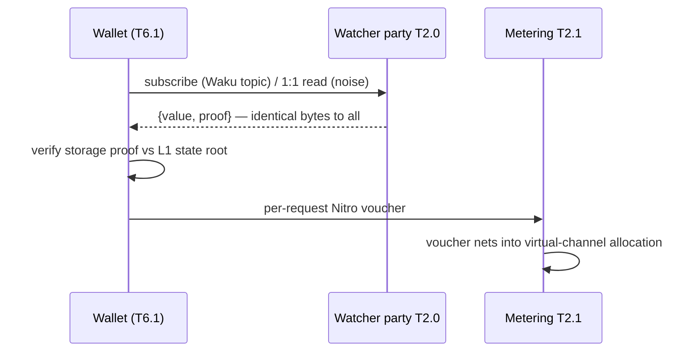

# 6. Runtime View

arc42 §6 · 2026-09-04

Four key scenarios show how the static building blocks of §5 collaborate at run time. Each scenario is a sequence of steps that names the `T#.#` items involved; the [§5 registry](./05-building-block-view.md) remains authoritative for those ids and their status. Every scenario shares one spine construction — *notes in → normal Nitro → notes out* ([ADR-0004](./09-architecture-decisions.md#adr-0004)) — and amounts become public only at the T0.3 boundary (Design A, [ADR-0005](./09-architecture-decisions.md#adr-0005)).

## 6.1 Shield & settle — nitro-on-railgun happy path

This is the base spine. A user brings value into the pool, funds a channel, plays cooperatively off-chain, and exits to fresh notes, with no swap and no dispute.



1. **Shield.** The wallet (T6.2) shields value into the T0.0 pool, generating the Groth16 proof on device via T6.6 — browser snarkjs-WASM or mobile rapidsnark run against the T0.0 `wasm`+`zkey`. Custody remains a shielded note throughout.
2. **Deposit / unshield-in.** T6.2 drives the T0.3 deposit endpoint, which unshields the note and uses its value to open and fund a Nitro channel via the T0.2 `NitroAdjudicator`. **This is the one public boundary amount** (Design A). T0.3 records the consumed nullifier and the funded `channelId` (`Deposit(channelId, asset, amount, consumedNullifier)`).
3. **Off-chain play.** Counterparties exchange **signed ForceMove states and payment vouchers** (T0.2) over virtual channels routed through a hub; these are pure state machines with no circuits involved. Delivery rides the T2.3 libp2p-noise 1:1 hot loop, and metering vouchers (T2.1) pay for any watcher reads.
4. **Cooperative close.** When both sides agree, T6.2 co-signs a final state and calls the T0.3 cooperative close, and the adjudicator finalizes without opening a challenge window.
5. **Payout / shield-out.** The T0.3 payout endpoint reads the channel outcome and **shields it into fresh notes**, a fresh-shield exit that preserves POI (T0.0). Settlement returns to notes rather than public keys (`Payout(channelId, newCommitments[])`).
6. **Scan.** The wallet's T6.1 WASM note-scanner pulls the `Payout` commitment slice from the T2.0 proof-carrying feed, verifies the storage proof against L1, and **trial-decrypts locally** to find the new notes. No public RPC query ever leaves the device.

→ boundary detail §5 T0.3; read-path privacy §8.

## 6.2 Private yield→USDC swap

This is the end-to-end v1 product deliverable: a shielded ETH-yield note (wstETH) swapped to shielded USDC at a posted price, with custody retained throughout ([ADR-0007](./09-architecture-decisions.md#adr-0007): RFQ posted-price venue).



1. **Note → channel** (T0.3). The wallet unshields a shielded wstETH note into the deposit endpoint, opening and funding a Nitro channel at the one public boundary amount. wstETH is non-rebasing (T4.4), so it is a clean shielded note that already earned staking yield simply by being held; the venue is needed only to swap it to USDC.
2. **Quote** (T4.1 → T4.0). The wallet requests a quote over the metered feed. The T4.1 quote/settle ForceMove app reads the current signed posted bid/ask from the T4.0 `priceSetter`-gated contract and returns a take-it-or-leave-it quote, which the wallet displays and verifies before filling against it.
3. **Settle** (T4.1). On acceptance, the quote/settle app — registered in the T0.3 ForceMove app registry — advances `propose-quote → accept → fill → settle` to a co-signed fill state at the posted price, taking the user leg (wstETH) out and the venue leg (USDC) in. A **missing settlement receipt ⇒ force-close to the pre-fill state**, so a stalled settle never costs funds.
4. **Fill from inventory** (v1). The venue fills the USDC leg from its **pre-funded static inventory** at the posted price. No market-making runs in v1 — no internalization, no hedge, no Aave rebalance; the automated solver (**T4.2**) and the LP-buffered USDC rail (**T4.5**) are **v2** ([ADR-0011](./09-architecture-decisions.md#adr-0011)). The venue sees only a shielded note address, never a user identity. When inventory runs low the venue withdraws quotes until refilled; nothing is ever at custody risk.
5. **Payout → fresh USDC notes** (T0.3). Channel finalize routes the outcome through the payout endpoint, which shields fresh USDC notes to the user with no linkage back to the deposit note beyond the boundary amount.
6. **Clearing & fee-split** (T4.3). The trade and the venue's fee **clear the same way**: the co-signed channel allocation splits value across **user / protocol / integrator** and nets to L1 in USDC over go-nitro `MultiAssetHolder`/`virtualfund`/`payments`. Per-quote and per-settle RPC is metered with T2.1 vouchers, so the venue is paid for quoting without ever taking custody. The wallet then scans the new notes (T6.1) as in §6.1.

→ USDC-yield (LP-buffered Aave rail) variant §5 T4.5; ex_net v2 upgrade §5 T4.6.

## 6.3 Dispute / force-close

This is the safety scenario. A counterparty tries to steal by force-closing an old state that favours them while the user is offline, and the watchtower defeats the attempt. It is the highest-priority test surface in the tier.

```mermaid
sequenceDiagram
  participant C as Counterparty
  participant N as Adjudicator T0.2
  participant F as Feed T2.0/T1
  participant WT as Watchtower T6.3
  participant D as Deposit/Payout T0.3
  C->>N: forceMove(stale state) → challenge window opens
  N-->>F: Challenge event
  F-->>WT: Challenge over feed (freshness-gated)
  WT->>WT: check feed fresh; find higher-turn co-signed state
  WT->>D: respond/checkpoint(higher-turn state) in window
  D->>N: finalize on correct latest state
  D->>D: PAYOUT fresh notes to honest user
```

1. **Stale-state challenge.** The counterparty submits a superseded state via `forceMove` on the T0.2 `NitroAdjudicator`, opening a challenge window that will finalize the stale state if left unanswered. The challenge/dispute *machinery* is owned by T0.2.
2. **Event over feed.** The adjudicator emits a `Challenge` event, which T1.2 indexes and the T2.0 proof-carrying feed serves (`Challenge`/`Checkpoint`/`Finalized`). The T2.0 head cursor exposes feed freshness.
3. **Watchtower fires, gated on freshness.** The phone-resident T6.3 watchtower — the same T6.1 scanner loop watching a different event — sees the `Challenge`. It **gates on T2 feed freshness**: a stale or lagging feed is treated as a liveness alarm, prompting a fall back to a redundant party or direct submit rather than a silently missed window.
4. **Higher-turn response.** T6.3 signs and submits the user's **higher-turn co-signed state** — drawn from T6.2's driven channel state — through the T0.3 `respond`/`checkpoint` path within the window, relayed gaslessly via the keeper/broadcaster (T6.5). Correctness — never miss a valid challenge, never submit a superseded state — is owned jointly with T0.2/T0.3.
5. **Correct finalize → payout.** The adjudicator finalizes on the correct latest state, and the T0.3 payout endpoint shields that outcome into fresh notes for the honest user. Non-custody holds: a dead or malicious counterparty can freeze trading but never the funds.

→ watchtower deployment §5 T6.3; freshness gate §5 T2.0; go-nitro dispute-wiring long pole §11.

## 6.4 Private metered read

This is the read-path scenario on which the whole anonymity-set guarantee rests ([ADR-0008](./09-architecture-decisions.md#adr-0008) transport; ★ do-first): a wallet consumes a proof-carrying feed and pays per request over private Nitro vouchers, leaking nothing about what it reads or who reads it.



1. **Subscribe.** The wallet (T6.1 scanner / watchtower loop) discovers a feed by Waku content-topic (T2.3, e.g. `/armada/v1/${chainId}-pool-commitments/json`) and reads slices, using async gossip over Waku or the libp2p-noise 1:1 hot loop for low-latency reads.
2. **Proof-carrying response.** The T2.0 watcher party serves each read as `getStorageAt → {value, proof}` from `watcher-ts`. Every subscriber to a slice receives **byte-identical** responses, the anti-fingerprint property that stops the data provider from learning which commitments or nullifiers the user scans.
3. **Verify locally.** The wallet verifies the storage/Merkle proof against the L1 block state root, trusting the math rather than the watcher. A lying `value` fails the proof, and no `eth_getLogs`/`eth_getStorageAt` ever leaves the device to a public RPC.
4. **Pay per request** (T2.1). The wallet pays a go-nitro payment voucher (`payments/vouchers.go` via `payments.ts`) for each paid feed method. Metering funds were provisioned **at note creation** and stay private; because this is the same voucher mechanism T0.2/T0.3 publishes, watcher payment leaks nothing about the reader.
5. **Net & settle.** Vouchers net into a co-signed **virtual-channel** allocation (`virtualfund.go`), settled to L1 in USDC on close. A replayed or out-of-order voucher is rejected (go-nitro nonce/redemption), and an unpaid request is refused without exposing the requester. Watcher metering is one of the two revenue pillars (venue spread + watcher metering).

→ feed schema & identical-bytes invariant §5 T2.0; metering interface §5 T2.1; read/write privacy duality §8.
