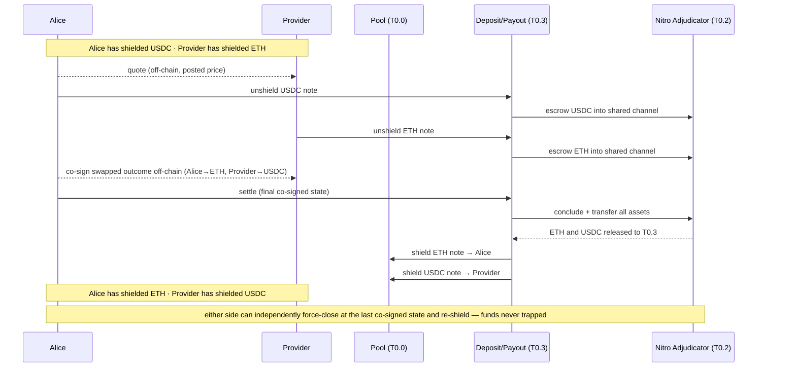
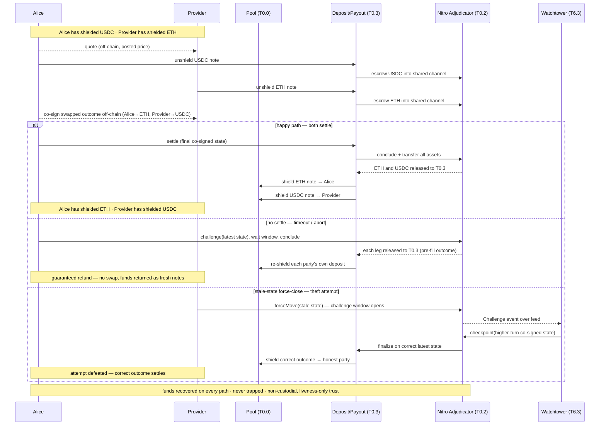

# Two-party shielded swap — walkthrough

standalone walkthrough · 2026-09-15

## What this shows

Armada is a shielded pool for private USDC and ETH. Value is held as encrypted **notes**, and every transfer is a zero-knowledge proof that hides sender, recipient, and amount. Payments and swaps settle off-chain over **Nitro state channels** instead of on-chain, so the pool exposes no per-transaction event to link against, and no party ever takes custody of another's funds.

This document walks one scenario end to end: **Alice swaps shielded USDC for shielded ETH with a Provider who holds shielded ETH**, on a single chain, non-custodially. It is self-contained — the building blocks are defined inline, and the status table at the end separates what already exists from what is net-new.

The flow follows one motto: **notes in → normal Nitro → notes out.** Both parties unshield notes into a shared settlement channel, they settle off-chain, and the outcome is re-shielded into fresh notes.

## The building blocks in play

Each is a `T#.#` item in the building-block registry:

- **Shielded pool (T0.0)** — holds value as notes. `shield` mints a note, `unshield` releases the underlying ERC-20, and `transact` proves a private transfer. Alice's USDC and the Provider's ETH live here as notes.
- **Deposit/payout contract (T0.3)** — the boundary between the pool and Nitro. It unshields a note into a channel (deposit) and re-shields a channel outcome into fresh notes (payout).
- **Nitro adjudicator (T0.2)** — the reused `go-nitro` `NitroAdjudicator` (ForceMove + MultiAssetHolder). It escrows the channel's funds, finalizes outcomes, and enforces disputes.
- **Quote/settle app (T4.1)** — the ForceMove application the two parties co-sign to express the swapped outcome. For a two-asset trade it is the multi-asset ETH-in / USDC-out settlement app.
- **Wallet (T6)** — Alice's and the Provider's client software. It proves on device, drives the channel, scans for new notes, and runs a watchtower.

## The sequence — happy path

1. **Quote (off-chain).** Alice's wallet requests a price and the Provider answers. The quote is a take-it-or-leave-it posted price (T4.0); nothing has touched the chain yet.
2. **Both fund one shared channel.** Alice unshields her USDC note through T0.3, which escrows the USDC into a `go-nitro` channel on the adjudicator. The Provider does the same with an ETH note into the **same** channel. Each unshield is one public boundary amount (see below); the notes themselves stay unlinked.
3. **Co-sign the swap off-chain.** The two parties advance the quote/settle app (T4.1) to a single co-signed final state whose outcome flips the allocations: Alice's balance becomes ETH, the Provider's becomes USDC. This is an ordinary Nitro state exchange — no proof, no chain event.
4. **Conclude atomically.** Either party submits the final state to T0.3, which calls the adjudicator's `concludeAndTransferAllAssets`. One transaction pays both legs out of the one escrow, so the swap either completes for both sides or for neither.
5. **Re-shield.** T0.3 receives the ERC-20 for each leg as an external destination and shields fresh notes: an ETH note to Alice, a USDC note to the Provider.
6. **Scan.** Each wallet's on-device note-scanner (T6.1) finds its new note over the proof-carrying feed and trial-decrypts locally. No public RPC query leaves the device.

## What is public, what is private

- **Private throughout:** who Alice and the Provider are, the notes they hold, and the swap itself (an off-chain co-signed state).
- **Public exactly at the boundary:** the amount at each unshield-in, and the shielded outputs at payout. This is Design A ([ADR-0005](./09-architecture-decisions.md#adr-0005)); the allocation flip that performs the swap never reaches the chain.

## Either side can exit independently

Neither party depends on the other's cooperation to get its funds back.

- If a counterparty stalls before settle, the other force-closes on the adjudicator at the **latest co-signed state** (`challenge`, wait the window, `conclude`), and T0.3 re-shields its correct balance.
- If a counterparty force-closes a **stale** state to try to steal, the other party's **self-watchtower (T6.3)** answers with the higher-turn co-signed state inside the challenge window.

Funds are never trapped and never held in a counterparty's custody; the worst a bad actor can do is stall trading. The dispute path is detailed in the runtime view (§6.3).

## Full sequence — happy and unhappy paths

The full picture adds the two unhappy branches to the same flow. Everything through the deposits and the off-chain co-sign is shared; the paths diverge at **settle**. The honest party's **watchtower (T6.3)** appears only in the theft branch. The generic dispute machinery is the runtime view's force-close scenario ([§6.3](./06-runtime-view.md)).

**What stays private on a forced exit — and what doesn't.**

- **Same as the happy path (hidden):** the payout is a **fresh note**, recipient-unlinkable; the depositor's identity and source note stay hidden (in-circuit ownership, only a nullifier); and the submitting EOA stays hidden, since the dispute txs (`challenge`/`checkpoint`/`conclude`) are keeper-relayed (T6.3/T6.5).
- **New on a forced close (public):** the outcome **amount** — a *contested* conclusion reveals the swap's size on-chain (Design A) — plus the `channelId`, the fact of the dispute, and its timing.

The happy path settles off-chain and leaks none of this; the amount is the residual [T0.6 fork-lite](./A-nitro-on-railgun/A.9-native-commitment.md) (hidden-amount outcomes) closes ([ADR-0005](./09-architecture-decisions.md#adr-0005)).

## Build status and difficulty

Each component carries two facets: its **status** — reused today or net-new — and its **difficulty** on the build plan's linear 1–10 scale, where 1 is trivial configuration or reuse and 10 is a large, audit-critical, novel build. The scores come from the [build plan](./build-plan.md) effort table, which weights net-new work, audit exposure, and novelty rather than calendar time.

A third facet, **scope**, keeps the difficulty honest. Almost everything this swap touches is **shared v1 substrate** — the shielded pool, its circuits, the Nitro settlement rail, and the wallet — which every Armada scenario needs and which is built once. Only a small part is **specific to this swap**.

| Item | Status | Pts | Scope |
|---|---|---:|---|
| Shielded pool — shield / unshield / transact (T0.0) | net-new (ADR-0014) | 10 | shared |
| JoinSplit circuits + ceremony (T0.1) | net-new (ADR-0014) | 9 | shared |
| Deposit/payout contract (T0.3) | net-new | 5 | shared |
| On-device Groth16 proving (T6.6) | reuse (constraint) | 5 | shared |
| Settlement client (T6.2) | net-new | 5 | shared |
| Self-watchtower (T6.3) | net-new | 5 | shared |
| WASM note-scanner (T6.1) | net-new | 5 | shared |
| Transport — Waku + libp2p-noise (T2.3) | reuse | 3 | shared |
| Nitro adjudicator — ForceMove / MultiAssetHolder (T0.2) | reuse | 2 | shared |
| Proof-carrying feeds (T2.0) | reuse+config | 2 | shared |
| Metering vouchers (T2.1) | reuse+config | 2 | shared |
| ↳ Channel machinery — virtualfund, payments, ExitFormat | reuse | incl. → T0.2 | shared |
| Quote/settle ForceMove app (T4.1) | net-new | 4 | swap |
| Posted-price contract (T4.0) | net-new (small) | 3 | swap |
| ↳ Multi-asset outcome helper | net-new | incl. → T0.3 | swap |

| Bucket | Pts |
|---|---:|
| Shared v1 substrate | 53 |
| Swap-specific (T4.0 + T4.1) | 7 |
| **Total (standalone rows)** | **60** |

**Key**

| Facet | Value | Meaning |
|---|---|---|
| **Status** | `reuse` | used as-is |
| | `reuse+config` | wired with configuration |
| | `net-new` | must build |
| **Scope** | `shared` | v1 substrate every scenario needs |
| | `swap` | specific to this swap |
| **Pts** | `1–10` | linear difficulty (1 = trivial config/reuse, 10 = large / audit-critical / novel) |
| **incl.** | — | folded into the parent's points; not added to the total |

The many small net-new rows are mostly this foundation, not swap cost. The swap rides about **53 points of shared substrate for a ~7-point swap-specific delta**: the posted-price contract (3) and the quote/settle app (4), with the multi-asset outcome shaping folded into the deposit/payout contract. The quote/settle app carries the real swap-specific risk. No shipped ForceMove app settles a two-asset ETH-in/USDC-out outcome atomically, so it is the go-nitro maturity gap the build plan tracks (§11 R2). The walking skeleton stands in a trivial single-asset app until it lands.

Within the 53, about **14 points are the base Nitro settlement rail**: the adjudicator (T0.2), the deposit/payout boundary (T0.3), the settlement client (T6.2), and voucher metering (T2.1). The remaining **~39 are the shielded-pool side**, dominated by the pool (10) and its circuits (9). Those two are the audit-critical core of the whole programme (§11), which is why they carry the highest scores. Everything reused — the adjudicator, feeds, metering, transport, and proving — sits at 2 to 5. The pool and circuits are our own implementation of the Railgun design ([ADR-0014](./09-architecture-decisions.md#adr-0014)), which is what makes them net-new rather than a redeploy.

Two boundaries keep the 53 from being read as more than it is:

- **It is a slice of v1, not all of it.** The v1 build totals 110 points; the 53 counts only the items on this swap's path. State ingestion (T1), the anonymity-set strategy (T0.7), the Adapters (T5), the fee-split, and several wallet items belong to v1 but sit off this path.
- **It is the base Nitro rail, not the cross-chain one.** This swap is same-chain, so it uses the reused go-nitro adjudicator (T0.2, 2 points). The v1.5 nitro-railgun cross-chain adjudicator ([ADR-0015/0016](./09-architecture-decisions.md#adr-0015), +6 points) is a different scenario and is not counted here.

The full path is proven end to end only once the **walking skeleton** runs: a thin `shield → deposit → trivial settle → payout → scan` slice on a laconic fixturenet that retires integration risk before any item deepens (§4, [build plan](./build-plan.md)).

## Where this fits

- **Same rail, venue-inventory variant** (the Provider's side pre-funded as static venue inventory rather than a per-swap deposit): runtime view [§6.2](./06-runtime-view.md).
- **Base spine** (bring value in, settle, exit — no swap): [§6.1](./06-runtime-view.md). **Dispute / force-close** path: [§6.3](./06-runtime-view.md).
- **Contract-level detail** for the boundary: [A.5 deposit/payout contract](./A-nitro-on-railgun/A.5-deposit-payout-contract.md).
- **Decisions:** [ADR-0004](./09-architecture-decisions.md#adr-0004) (settle via nitro-on-railgun), [ADR-0005](./09-architecture-decisions.md#adr-0005) (Design A amount privacy), [ADR-0007](./09-architecture-decisions.md#adr-0007) (posted-price venue). **Status & effort:** [build plan](./build-plan.md).
