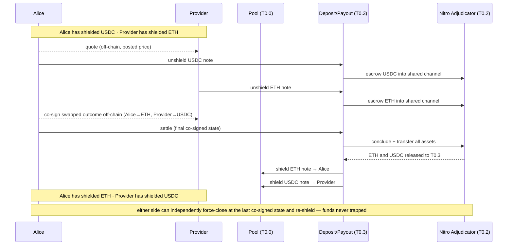

# Two-party shielded swap — walkthrough

standalone walkthrough · 2026-09-15

## What this shows

Armada is a shielded pool for private USDC and ETH. Value is held as encrypted **notes**, and every transfer is a zero-knowledge proof that hides sender, recipient, and amount. Payments and swaps settle off-chain over **Nitro state channels** instead of on-chain, so the pool exposes no per-transaction event to link against, and no party ever takes custody of another's funds.

This document walks one scenario end to end: **Alice swaps shielded USDC for shielded ETH with a Provider who holds shielded ETH**, on a single chain, non-custodially. It is self-contained — the building blocks are defined inline, and the status table at the end separates what already exists from what is net-new.

The flow follows one motto: **notes in → normal Nitro → notes out.** Both parties unshield notes into a shared settlement channel, they settle off-chain, and the outcome is re-shielded into fresh notes.

## The building blocks in play

Each is a `T#.#` item in the building-block registry:

- **Shielded pool (T0.0)** — holds value as notes. `shield` mints a note, `unshield` releases the underlying ERC-20, and `transact` proves a private transfer. Alice's USDC and the Provider's ETH live here as notes.
- **Deposit/payout contract (T0.3)** — the boundary between the pool and Nitro. It unshields a note into a channel (deposit) and re-shields a channel outcome into fresh notes (payout).
- **Nitro adjudicator (T0.2)** — the reused `go-nitro` `NitroAdjudicator` (ForceMove + MultiAssetHolder). It escrows the channel's funds, finalizes outcomes, and enforces disputes.
- **Quote/settle app (T4.1)** — the ForceMove application the two parties co-sign to express the swapped outcome. For a two-asset trade it is the multi-asset ETH-in / USDC-out settlement app.
- **Wallet (T6)** — Alice's and the Provider's client software. It proves on device, drives the channel, scans for new notes, and runs a watchtower.

## The sequence

1. **Quote (off-chain).** Alice's wallet requests a price and the Provider answers. The quote is a take-it-or-leave-it posted price (T4.0); nothing has touched the chain yet.
2. **Both fund one shared channel.** Alice unshields her USDC note through T0.3, which escrows the USDC into a `go-nitro` channel on the adjudicator. The Provider does the same with an ETH note into the **same** channel. Each unshield is one public boundary amount (see below); the notes themselves stay unlinked.
3. **Co-sign the swap off-chain.** The two parties advance the quote/settle app (T4.1) to a single co-signed final state whose outcome flips the allocations: Alice's balance becomes ETH, the Provider's becomes USDC. This is an ordinary Nitro state exchange — no proof, no chain event.
4. **Conclude atomically.** Either party submits the final state to T0.3, which calls the adjudicator's `concludeAndTransferAllAssets`. One transaction pays both legs out of the one escrow, so the swap either completes for both sides or for neither.
5. **Re-shield.** T0.3 receives the ERC-20 for each leg as an external destination and shields fresh notes: an ETH note to Alice, a USDC note to the Provider.
6. **Scan.** Each wallet's on-device note-scanner (T6.1) finds its new note over the proof-carrying feed and trial-decrypts locally. No public RPC query leaves the device.

## What is public, what is private

- **Private throughout:** who Alice and the Provider are, the notes they hold, and the swap itself (an off-chain co-signed state).
- **Public exactly at the boundary:** the amount at each unshield-in, and the shielded outputs at payout. This is Design A ([ADR-0005](./09-architecture-decisions.md#adr-0005)); the allocation flip that performs the swap never reaches the chain.

## Either side can exit independently

Neither party depends on the other's cooperation to get its funds back.

- If a counterparty stalls before settle, the other force-closes on the adjudicator at the **latest co-signed state** (`challenge`, wait the window, `conclude`), and T0.3 re-shields its correct balance.
- If a counterparty force-closes a **stale** state to try to steal, the other party's **self-watchtower (T6.3)** answers with the higher-turn co-signed state inside the challenge window.

Funds are never trapped and never held in a counterparty's custody; the worst a bad actor can do is stall trading. The dispute path is detailed in the runtime view (§6.3).

## Status — what's done, what's net-new

Legend (from the [build plan](./build-plan.md)):

- **Status:** `reuse` = used as-is · `reuse+config` = wired with configuration · `net-new` = must build · `partial` = exists, needs work
- **Confidence:** `validated` = code read/grounded this cycle · `design` = specified against a reference

| Item | Role in this swap | Status | Confidence |
|---|---|---|---|
| Nitro adjudicator — ForceMove / MultiAssetHolder (T0.2) | escrows both legs; `conclude + transfer`; dispute enforcement | reuse — go-nitro `@435eb2b` | validated |
| Channel machinery — virtualfund, payments/vouchers, ExitFormat | off-chain state and voucher exchange; outcome wire format | reuse — go-nitro `@435eb2b` | validated |
| Metering vouchers (T2.1) | per-read payment for feed access | reuse+config | validated |
| Proof-carrying feeds (T2.0) | the read path each wallet scans for new notes | reuse+config | design |
| Transport (T2.3) — Waku + libp2p-noise | delivers off-chain states and vouchers | reuse | design |
| On-device Groth16 proving (T6.6) | generates the shield / unshield / transact proofs | reuse (constraint) | design |
| Shielded pool — shield / unshield / transact (T0.0) | holds the notes and mints the swapped ones | net-new — our own implementation of the Railgun design ([ADR-0014](./09-architecture-decisions.md#adr-0014)) | design |
| JoinSplit circuits + ceremony (T0.1) | the zero-knowledge behind every note operation | net-new (ADR-0014) | design |
| Deposit/payout contract (T0.3) | unshield-in → escrow; conclude → shield-out | net-new | design |
| Multi-asset outcome helper (T0.3) | builds the atomic ETH-out + USDC-out outcome | net-new | design |
| Quote/settle ForceMove app (T4.1) | the swapped-outcome state both parties co-sign; the multi-asset ETH-in/USDC-out case is the go-nitro maturity gap (§11 R2) | net-new — walking skeleton uses a trivial single-asset stand-in | design |
| Posted-price contract (T4.0) | the signed bid/ask the quote reads | net-new (small) | design |
| Settlement client (T6.2) | drives fund → co-sign → settle from the wallet | net-new | design |
| Self-watchtower (T6.3) | independent force-close / higher-turn checkpoint | net-new | design |
| WASM note-scanner (T6.1) | finds the swapped notes on-device | net-new | design |

**Reading the table.** Everything reused — the adjudicator, the channel machinery, transport, proving, and metering — is validated or config-level today. Everything net-new — the pool, the circuits, T0.3, the multi-asset swap app, and the wallet's client, watchtower, and scanner — is design-level. The full path is proven end-to-end only once the **walking skeleton** runs: a thin `shield → deposit → trivial settle → payout → scan` slice on a laconic fixturenet that retires integration risk before any item deepens (§4, [build plan](./build-plan.md)).

## Where this fits

- **Same rail, venue-inventory variant** (the Provider's side pre-funded as static venue inventory rather than a per-swap deposit): runtime view [§6.2](./06-runtime-view.md).
- **Base spine** (bring value in, settle, exit — no swap): [§6.1](./06-runtime-view.md). **Dispute / force-close** path: [§6.3](./06-runtime-view.md).
- **Contract-level detail** for the boundary: [A.5 deposit/payout contract](./A-nitro-on-railgun/A.5-deposit-payout-contract.md).
- **Decisions:** [ADR-0004](./09-architecture-decisions.md#adr-0004) (settle via nitro-on-railgun), [ADR-0005](./09-architecture-decisions.md#adr-0005) (Design A amount privacy), [ADR-0007](./09-architecture-decisions.md#adr-0007) (posted-price venue). **Status & effort:** [build plan](./build-plan.md).
