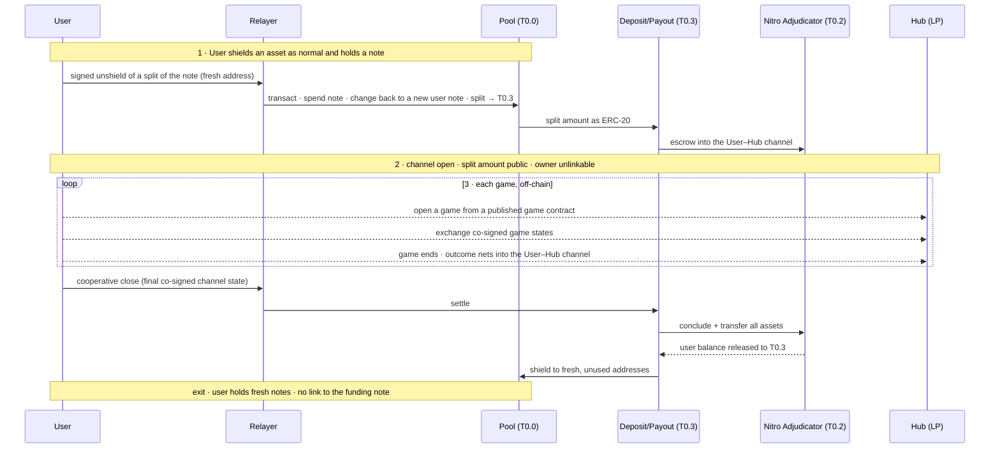
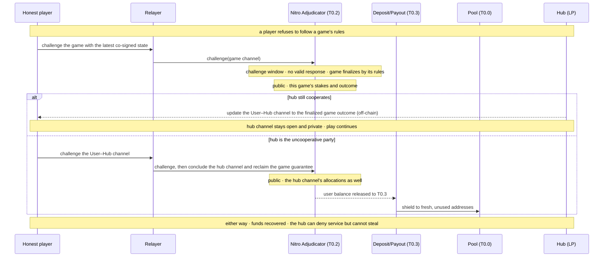

# Shielded games over Nitro — structure

standalone walkthrough · 2026-09-24

## What this shows

Armada holds value as shielded **notes** in its pool: sender, recipient, and amount are hidden in-circuit. This page shows how a user takes part of a note, opens a **Nitro state channel to a hub**, and plays **games** against the hub or other users, with every game enforceable on Ethereum and every exit landing back in the pool at unused addresses.

A **game** is a ForceMove application: a contract published on Ethereum that defines which state transitions are valid and how a finished game splits its stakes. Players exchange signed states off-chain. Ethereum sees a game only if a player refuses to follow its rules.

The structure in four steps:

1. **Shield.** A user shields any asset into Armada as normal and receives a note.
2. **Open a channel to a hub.** Using a fresh address and a relayer, the user takes a split of that note and opens a Nitro channel to a **hub**. The hub is a liquidity provider whose identity is private. It can deny service but cannot steal: every balance is enforceable on-chain without its cooperation.
3. **Play games.** The user plays any published game with the hub, or with other users routed through the hub. A player who breaks a game's rules loses on Ethereum under that game's rules. Games that end cooperatively net back into the hub channel off-chain, and funds are shielded into Armada at otherwise unused addresses when the user exits.
4. **First games:** Aave USDC lending and borrowing, and swapping shielded WETH for wstETH.

## The happy path

1. **Shield.** An ordinary Armada shield. The user holds a note.
2. **Fund the hub channel.** The user signs an unshield of part of the note and hands it to a relayer, which submits it from its own address and is paid from the shielded balance. The pool spends the note, returns the change to a new user note, and sends the split as ERC-20 to the deposit/payout contract (T0.3), which escrows it into the User–Hub channel on the Nitro adjudicator. The split amount is public; the owner is not.
3. **Play.** Each game runs off-chain against a game contract published on Ethereum. The counterparty is the hub or another user routed through the hub over a virtual channel. When a game ends cooperatively, its outcome nets into the hub channel with no chain event, so many games cost one channel open.
4. **Exit.** A cooperative close settles the hub channel, and T0.3 shields the user's balance into fresh, unused addresses.

## When a player breaks the rules

A game is enforced on Ethereum by the same adjudicator that holds the channel. The honest player puts the latest co-signed game state on-chain. If the other player does not answer with a valid later state before the challenge window closes, the game finalizes under its own rules. A player who stalls or cheats therefore loses by those rules, and the loss is bounded by that game's stakes.

What reaches the chain depends on whether the hub still cooperates afterwards:

## What each step reveals

| Step | On-chain? | Amount public? | Linked to the user? |
|---|---|---|---|
| Shield into Armada | yes | yes, as any Railgun shield | the shield itself is an ordinary public deposit |
| Fund the hub channel (split, via relayer) | yes | the split amount | no: the note's owner is proven in-circuit, and the relayer's address submits |
| Play games, cooperative end | no | no | no |
| Exit: cooperative close | yes | the payout amounts | no: fresh, unused addresses |
| Game dispute, hub cooperates | yes | that game's stakes and outcome | no |
| Game dispute, hub uncooperative | yes | the game's stakes **and** the hub channel's allocations | no |

Adjudication reveals the stakes of the disputed game, not the user's balance in the pool. The hub-channel deposit is different. It is public from the moment the channel opens, as the split amount of the funding unshield (Design A, [ADR-0005](./09-architecture-decisions.md#adr-0005)). A dispute against an uncooperative hub also forces the hub channel on-chain, because Nitro releases a game's guarantee only from a finalized hub channel (`reclaim` in go-nitro's `MultiAssetHolder`). None of these amounts is linked to the user's identity. Hiding the amounts themselves is the T0.6 fork-lite upgrade ([A.9](./A-nitro-on-railgun/A.9-native-commitment.md)).

## The first games

**Swapping shielded WETH for wstETH.** The hub quotes a price, and the game moves the agreed WETH and wstETH between the two players inside the channel, atomically. Both assets live in the channel's escrow, so this needs a two-asset settlement game, the multi-asset ForceMove app the build plan tracks as net-new ([§11 R2](./11-risks-and-technical-debt.md)).

**Aave USDC lending and borrowing.** The hub runs the Aave position; the game settles the user's side of it in-channel.
- **Lending:** the user stakes USDC into the game, and the game's rules pay principal plus accrued interest at close.
- **Borrowing:** the user stakes collateral, receives USDC, and the game's rules repay principal plus interest or liquidate the collateral.

The Aave interaction is the hub's own public activity and is not linked to the user. For a dispute to enforce interest, the game needs an on-chain rate reference, such as Aave's reserve index. That rate reference and the liquidation rules for borrowing are open design points.

## Where this fits

- **Two-party swap walkthrough** (same rail, one direct channel): [13](./13-shielded-swap-walkthrough.md).
- **Settlement rail** — deposit/payout boundary and adjudicator: [A.0 overview](./A-nitro-on-railgun/A.0-overview.md), [A.5](./A-nitro-on-railgun/A.5-deposit-payout-contract.md).
- **Hubs, fronting, and routing across chains:** [cross-chain swap construction](./shielded-nitro-bridge-design.md).
- **Dispute mechanics and the watchtower:** runtime view [§6.3](./06-runtime-view.md).
- **Decisions:** [ADR-0004](./09-architecture-decisions.md#adr-0004) (settle via nitro-on-railgun), [ADR-0005](./09-architecture-decisions.md#adr-0005) (Design A), [ADR-0015](./09-architecture-decisions.md#adr-0015) (hubs, liveness-only trust).
